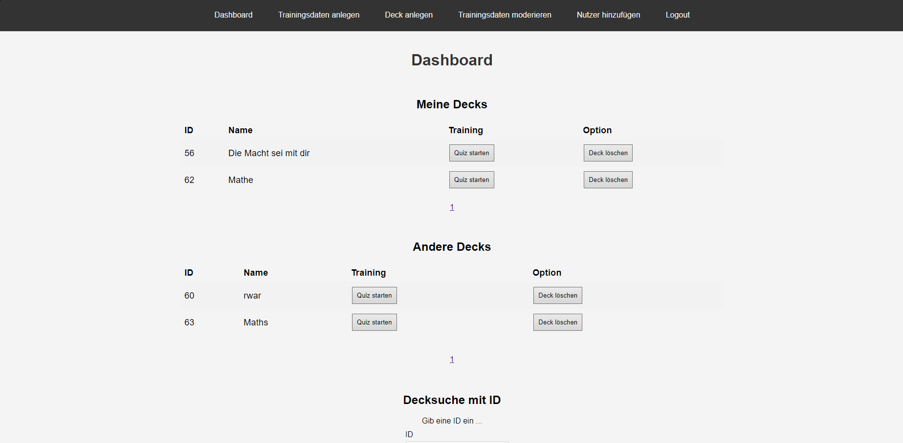
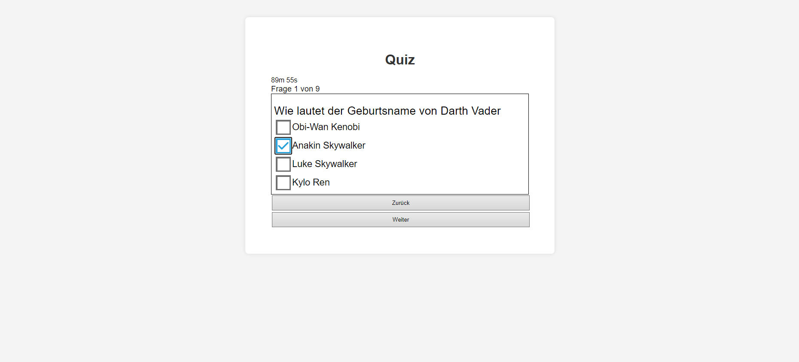
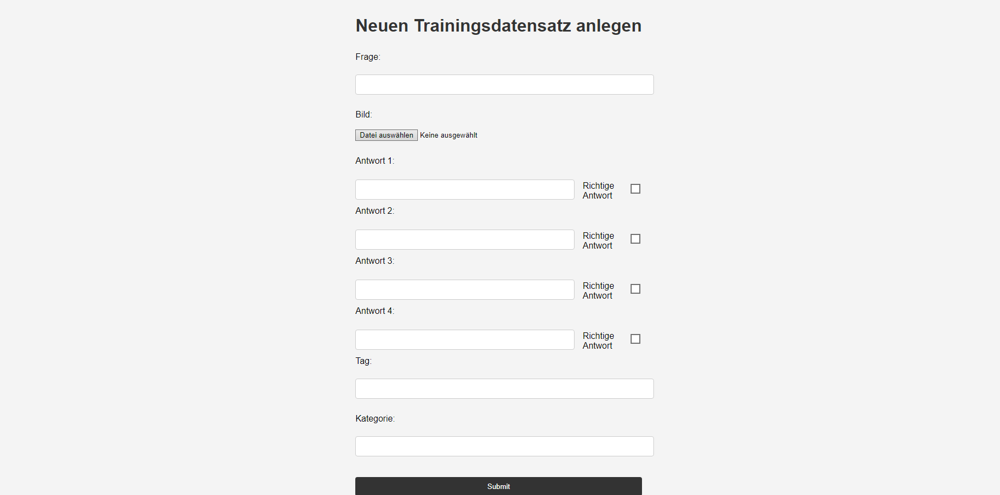
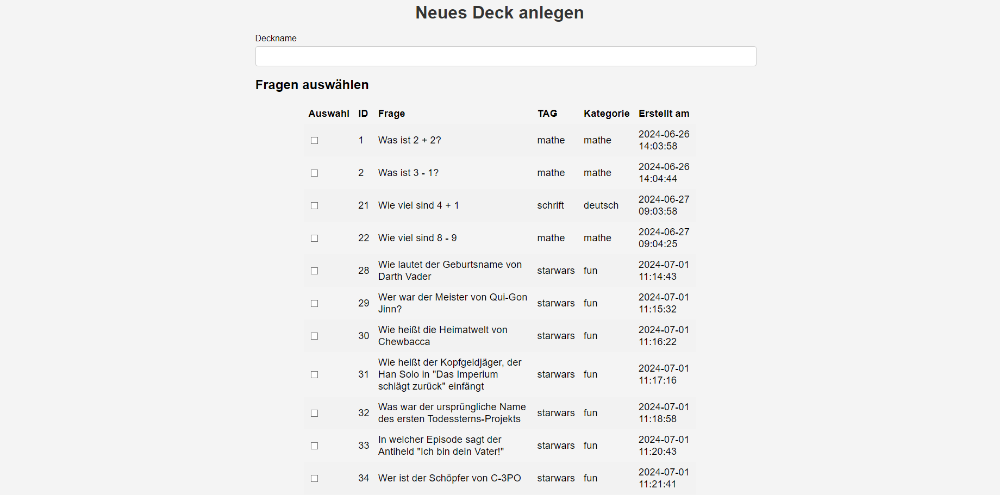
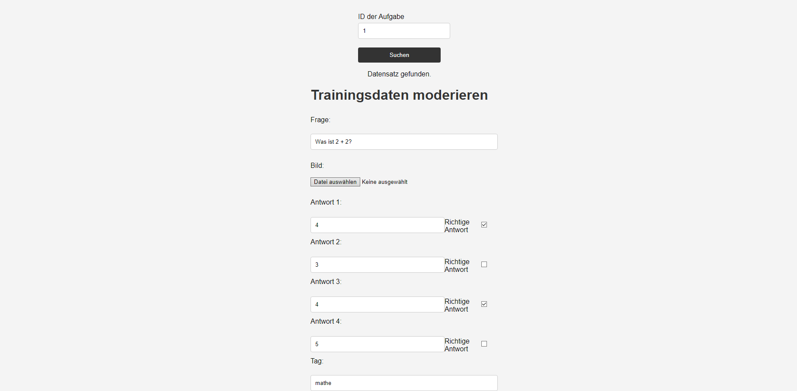
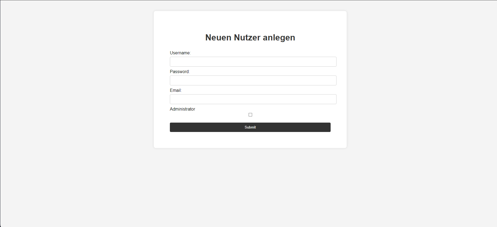

Final project of the second semester. A quiz app for preparing for exams. Users can create tasks and compile the tasks into decks and then consolidate their knowledge by taking a quiz.

In this project, experience was gained in SQL, PHP, HTML, CSS and JavaScript. Furthermore, both GET and POST APIs were used.

[Demo at haustein.in](https://haustein.in/trainingswebseite-quiz-php)

